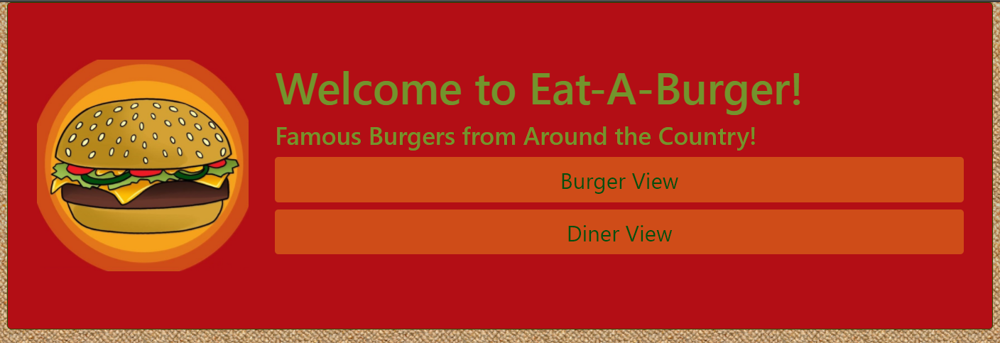
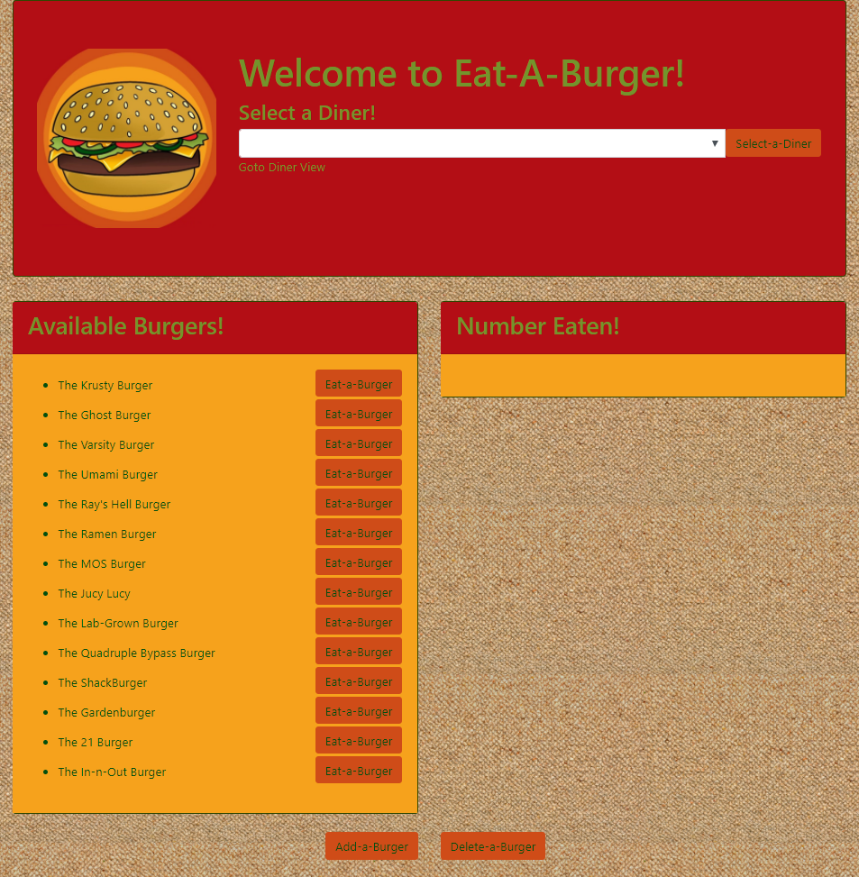
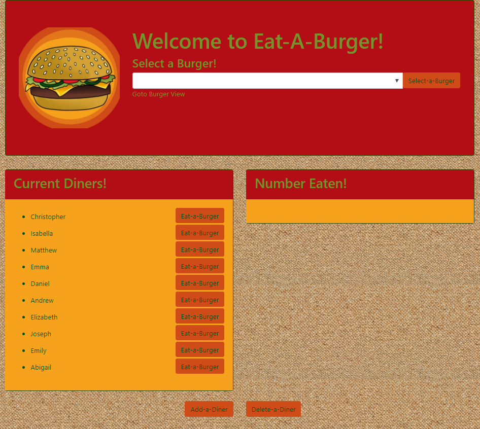

# Burger Bucket List - Sequelized!

### Overview

This application stores a list of burgers, the diner(s) who have eaten them, and the quantity consumed. The application has two views:
   * Burger View
   * Diner View

### Instructions

1. The application is located as follows:

   * Heroku deployment: [Burger Bucket List]()

   * GitHub repository: [Burger Bucket List GitHub Repository](https://github.com/bpzimmerman/burger-sequelize)

2. The application comes pre-loaded with some famous burgers as well as some diners.

#### Burger View

1. The Burger View will display all the burgers in the database on the left side and a select box at the top to select a Diner.

2. Selecting a Diner will display all the Burgers that that individual has eaten along with the quantity on the right side of the page.

3. Once a Diner has been selected, clicking an `Eat-a-Burger` button will either add the Burger to the list on the right with a quantity of 1 or will add 1 to the quantity of a Burger already in the list.

4. The `Add-a-Burger` and `Delete-a-Burger` buttons at the bottom of the page will display a modal that will allow the user to add a Burger to or remove a Burger from the database.

#### Diner View

1. The Diner View is essentially the opposite of the Burger View in that it will display all the Diners in the database on the left side of the page and a select box at the top to select a Burger.

2. Selecting a Burger will display all the Diners who have eaten that Burger along with the quantity eaten on the right side of the page.

3. Once a Burger has been selected, clicking an `Eat-a-Burger` button will either add the Diner to the list on the right with a quantity of 1 or will add 1 to the quantity of a Diner already in the list.

4. The `Add-a-Diner` and `Delete-a-Diner` buttons at the bottom of the page will display a modal that will allow the user to add a Diner to or remove a Diner from the database.